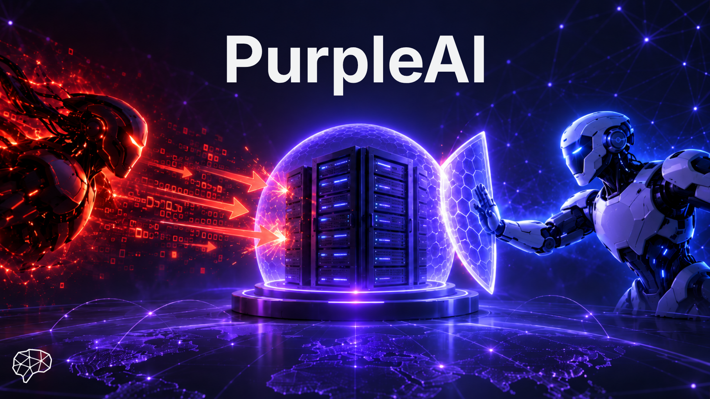

# purpleAI

<div align="center">


[](https://opensource.org/licenses/MIT)
[](https://img.shields.io/badge/version-0.0.1-blue)


</div>

<details> 
<summary><b>📋 Table of contents </b></summary>

- [purpleAI](#purpleai)
  - [Project description](#project-description)
    - [Technologies](#technologies)
  - [🛠️ Prerequisites](#️-prerequisites)
  - [Getting started](#getting-started)
  - [Usage](#usage)
    - [📖 Generate Documentation Site](#-generate-documentation-site)
  - [Testing](#testing)
  - [Team](#team)
    - [License](#license)

</details>

## Project description

**PurpleAI** is a student project at Cogito NTNU where we build AI agents that attack and defend. One agent acts as a hacker and tries to break into a deliberately vulnerable web app using techniques like SQL injection. The other acts as a defender, it sits in front of the app as a reverse proxy, uses an LLM to inspect every incoming request, and blocks anything that looks like an attack before it reaches the server. We started with SQL injection on a web app and plan to add more attack types and targets later. Red team + blue team = purple. 💜

### Technologies
- **LangChain Agents**: Autonomous agents with specialized tools for attack and defend mechanism.
- **Large Language Models**: Different models fron IDUN NTNU for natural language understanding and reasoning. 


## 🛠️ Prerequisites

- **Git**: Ensure that git is installed on your machine. [Download Git](https://git-scm.com/downloads)
- **Python 3.12**: Required for the backend. [Download Python](https://www.python.org/downloads/)
- **UV**: Used for managing Python environments. [Install UV](https://docs.astral.sh/uv/getting-started/installation/)
- **Docker & Docker Compose**: **Required** for running the ParadeDB database. [Download Docker](https://www.docker.com/products/docker-desktop)
- **Node.js** (v18+): Required for the frontend. [Download Node.js](https://nodejs.org/)
- **OpenAI API Key**: Required for GPT-4 access. [Get API Key](https://platform.openai.com/api-keys) 

## Getting started

1. **Clone the repository**:

   ```sh
   git clone https://github.com/CogitoNTNU/purpleAI.git
   cd purpleAI
   ```

2. **Install dependencies**:

   ```sh
   uv sync
   ```

<!--
1. **Configure environment variables**:
    This project uses environment variables for configuration. Copy the example environment file to create your own:
    ```sh
    cp .env.example .env
    ```
    Then edit the `.env` file to include your specific configuration settings.
-->

1. **Set up pre commit** (only for development):
   ```sh
   uv run pre-commit install
   ```

## Usage

To run the project, run the following command from the root directory of the project:

```bash

```

<!-- TODO: Instructions on how to run the project and use its features. -->

### 📖 Generate Documentation Site

To build and preview the documentation site locally:

```bash
uv run mkdocs build
uv run mkdocs serve
```

This will build the documentation and start a local server at [http://127.0.0.1:8000/](http://127.0.0.1:8000/) where you can browse the docs and API reference. Get the documentation according to the lastes commit on main by viewing the `gh-pages` branch on GitHub: [https://cogitontnu.github.io/PROJECT-TEMPLATE/](https://cogitontnu.github.io/PROJECT-TEMPLATE/).

## Testing

To run the test suite, run the following command from the root directory of the project:

```bash
uv run pytest --doctest-modules --cov=src --cov-report=html
```

## Team

This project was built by the PurpleAI team at Cogito NTNU. Thank you to everyone who contributed their hard work and dedication to making this project possible. It's been a great experience working together on this challenge.

<table align="center">
    <tr>
        <td align="center">
            <a href="https://github.com/frederik-lunde">
              <br />
              <sub><b>Frederik Lunde</b></sub>
            </a>
        </td>
        <td align="center">
            <a href="https://github.com/gunnarshaug">
              <br />
              <sub><b>Elisa Gunnarshaug</b></sub>
            </a>
        </td>
        <td align="center">
            <a href="https://github.com/adelethorberg-sudo">
              <br />
              <sub><b>Adele Thorberg</b></sub>
            </a>
        </td>
        <td align="center">
            <a href="https://github.com/vegardaaalbretsen">
              <br />
              <sub><b>Vegard Aa Albretsen</b></sub>
            </a>
        </td>
        <td align="center">
            <a href="https://github.com/ingunntonetta">
              <br />
              <sub><b>Ingunn Tonetta Erdal</b></sub>
            </a>
        </td>
        <td align="center">
            <a href="https://github.com/OdinV-ntnu">
              <br />
              <sub><b>Odin Vankan</b></sub>
            </a>
        </td>
        <td align="center">
            <a href="https://github.com/danielsamo-se">
              <br />
              <sub><b>Daniel Hauksson</b></sub>
            </a>
        </td>
        <!--
        Add more team members by copying the template below:
        <td align="center">
            <a href="https://github.com/USERNAME">
              <br />
              <sub><b>Full Name</b></sub>
            </a>
        </td>
        -->
    </tr>
</table>


### License

______________________________________________________________________

Distributed under the MIT License. See `LICENSE` for more information.
